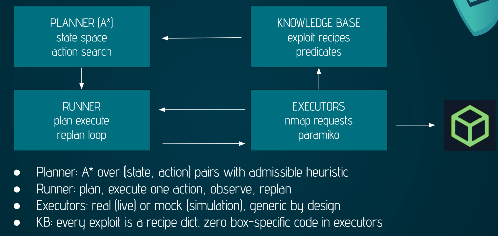
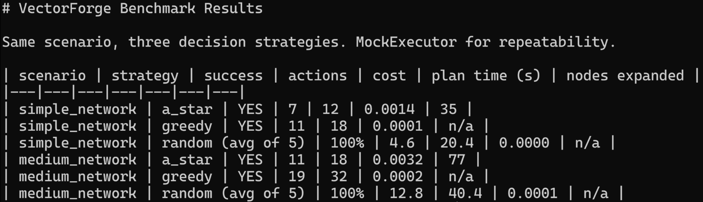
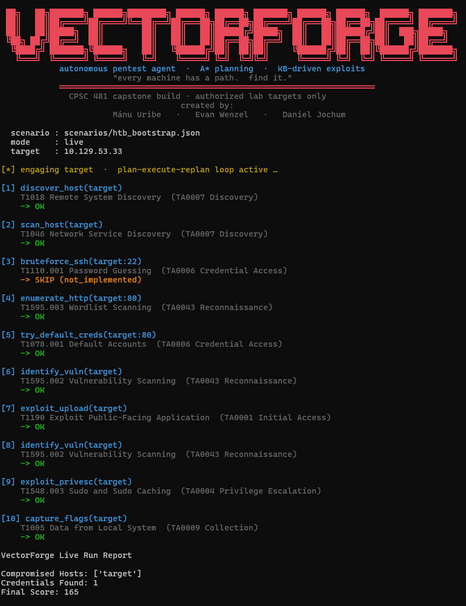
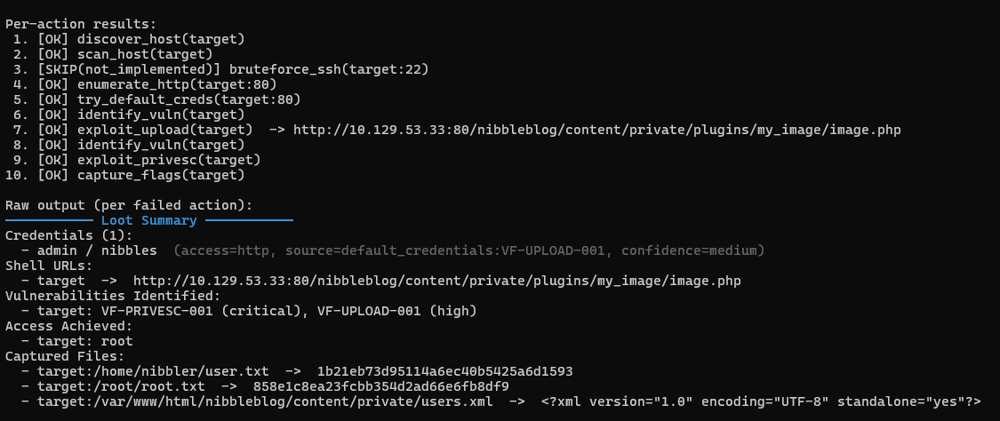

# CPSC 481 Capstone Project: VectorForge

**Daniel Jochum · Mánu Uribe · Evan Wenzel**

CPSC 481 · Mr. Paul Oginni · 13 May 2026

---

## Introduction

Security is one of the most pressing issues when it comes to making any sort of project in computers. Any vulnerabilities left unguarded by developers are at risk of being exploited by malefactors. While fixing and removing these vulnerabilities is an important part of security, the important first step is identifying any insecurities. This is often done with penetration testing, meant to identify exploitable points in a system as any malicious attacker would, but in a safe environment. This allows testers to find the vulnerabilities in their system and patch them. Penetration testing is expensive, manual, and bottlenecked on senior expertise. Existing autonomous tools either run scripted playbooks (brittle) or use LLMs end-to-end (non-deterministic, expensive, hallucinate). VectorForge uses a classical planner, as well as a structured knowledge base to find and execute attack chains. This approach both doesn't use an LLM, and allows the knowledge base to be updated for inclusion of new attack techniques.

---

## AI Concepts Used

### Heuristic Search (A\*)

The agent uses the A\* search algorithm to determine efficient attack paths through the network. The algorithm evaluates potential actions using a cost function that considers both the actions already taken and an estimated cost to reach the target system.

### State Space Representation

The penetration testing process is represented as a state space where each state contains information about discovered hosts, open services, obtained credentials, and compromised systems.

### Intelligent Agent Architecture

The system operates as an intelligent agent that perceives its environment through simulated scanning actions, updates an internal knowledge base, and selects actions that maximize the likelihood of achieving its objective.

### Rule-Based Reasoning

A rule system infers potential attack strategies based on discovered services and vulnerabilities. For example, if a vulnerable service version is detected, the agent may add a corresponding exploit action to its possible strategy set.

---

## Architecture

### Network Simulation Environment

A simulated network containing multiple hosts with different services, vulnerabilities, and connectivity were generated and represented as a graph structure.

### Scanning Module

The agent performs reconnaissance actions such as simulated port scanning and service discovery to gather information about the network.

### Knowledge Base

Discovered information about hosts, services, vulnerabilities, and privileges are stored in an internal knowledge base to guide future decisions. Exploits are also stored in the knowledge base to easily allow for implementing new methods.

### Planning and Decision Engine

The agent uses A\* heuristic search to evaluate possible attack paths and select the most promising sequence of actions.

### Action Execution

Selected actions are executed in the environment, and the results update the knowledge base, allowing the agent to continuously refine its strategy.

### Hack-The-Box

Hack the Box is an online platform that is created and utilized to practice and hone various hacking skills within a controlled environment. The platform utilizes various pre-generated virtual machines that are accessible to the user via terminal or an IP address. This allows users to learn and express their skills within a safe environment designed to be hacked into with purposely placed vulnerabilities to be exploited. Within the scope of VectorForge, the program can provide the target IP address of the HTB virtual machine in order to find the hidden flag. This gives a large assortment of testable environments for the algorithm to perform within, especially within a real-world scenario for testing purposes.

---

## Evaluation Method

The goals we want our AI to chase are finding the most severe, exposed, and local vulnerabilities, as fast as possible. So, each vulnerability in a simulated environment is given a score based on these factors. Total score for a found vulnerability is calculated as a mixture of the time it takes to find the vulnerability combined with the "importance" of the vulnerability. When being trained, our AI model is scored based on the total score for each vulnerability that it finds.

---

## Results

A\* finds the cheapest path in both scenarios. The cost gap widens with complexity: 4 units in a simple network becomes 12 units in a medium one. Therefore, it is evident that the planner pays for itself, and the gap grows with real-network scale.

---

## Potential Improvements

The main point of improvement is the heuristic we used, which assigned costs to actions the penetration tester may take. The costs we assigned to these actions are placeholders, decided with our general experience in testing rather than as a result of tests and statistics. It is recommended for future improvements that tests be done to determine the true costs of actions for a more refined heuristic. Aside from this, filling the knowledge base with a larger variety of exploits will invariably improve the accuracy of the penetration tester.
